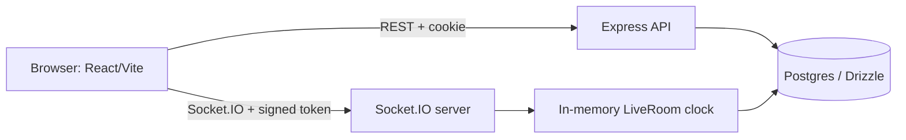

# MovieFlex v2 — YouTube Watch Party

Create or join rooms, watch YouTube in sync, chat and react in real time. Auth, public/private rooms, roles (host/moderator/member), discover, history and notifications are included.

## Features
- Email/username signup & login, HTTP-only Postgres-backed sessions, bcrypt hashing, zod validation
- Rooms: public/private, optional password, lock, max participants, invite code/link, rejoin
- Synced playback (play/pause/seek/change video), late-join & reconnect state, drift correction
- Roles enforced on the server: kick, transfer host, promote/demote, clear chat, delete room
- Chat (sanitised, rate limited, deletable, system messages) and ephemeral reactions
- Discover (search/pagination), watch history, notifications, profile
- Loading/empty/error states, toasts, confirm dialogs, offline/reconnect banner, mobile-first UI

## Architecture

- Auth: HTTP-only cookie `mf.sid` (rolling 7 days). Sockets authenticate with a short-lived signed token from `GET /api/auth/socket-token`.
- Realtime: the server owns an authoritative playback clock per room; clients never choose the room (taken from the socket's joined room); payloads validated and rate limited.
- API responses: `{ ok: true, data }` or `{ ok: false, error: { code, message } }`.

## Stack
React 18, Vite 5, TypeScript, Express 4, Socket.IO 4, Drizzle ORM, PostgreSQL (Neon-compatible), zod, helmet, express-rate-limit.

## Folder structure
```
client/   React app (pages, components, context, hooks, lib)
server/   Express + Socket.IO (routes, services, realtime, db, drizzle migrations, test)
e2e/      Two-browser Playwright script with a fake YouTube player
```

## Setup
Requires Node >= 18.18 and a Postgres database (e.g. a free Neon project).
```
npm install
cp server/.env.example server/.env     # fill DATABASE_URL and SESSION_SECRET
npm run dev                            # client http://localhost:5173, API http://localhost:4000
```
Migrations in `server/drizzle/` run automatically at boot (`AUTO_MIGRATE=false` to disable, or `npm run db:migrate`).

## Commands
| | |
|---|---|
| `npm run dev` | client + server with reload |
| `npm run build` | build client then server |
| `npm start` | run the built server |
| `npm run typecheck` | typecheck both workspaces |
| `npm test` | server tests (need `TEST_DATABASE_URL`) + client tests |

## Environment variables
Server (`server/.env.example`): `DATABASE_URL` (required), `SESSION_SECRET` (required, 32+ chars in production), `PORT`, `FRONTEND_URL` (comma-separated allowed origins), `SERVE_CLIENT`, `COOKIE_SAMESITE` (`lax`|`none`), `AUTO_MIGRATE`, `TEST_DATABASE_URL` (tests).
Client (`client/.env.example`): `VITE_API_URL`, `VITE_SOCKET_URL` (only for split deployments).
Never commit real values.

## Deployment
Socket.IO needs a long-lived process. Vercel serverless functions cannot host it.
- **Option A, one service (simplest):** deploy the repo to Render/Railway/Fly (see `render.yaml`) with `SERVE_CLIENT=true`; the API and client share an origin so cookies are first-party.
- **Option B, split:** frontend on Vercel (root `client/`, build `npm run build`, env `VITE_API_URL` and `VITE_SOCKET_URL` pointing at the backend; `client/vercel.json` adds the SPA rewrite). Backend on a persistent Node host with `FRONTEND_URL=https://your-app.vercel.app` and `COOKIE_SAMESITE=none` (HTTPS). Note: Safari may block third-party cookies in this mode; Option A avoids that.
- Database: Neon connection string in `DATABASE_URL` (SSL is auto-detected).

## Testing
- `npm test` — 41 server tests (auth, rooms, permissions, realtime sync, chat) + client unit tests.
- `node e2e/two-users.mjs` — two-browser end-to-end run (48 checks) against a running server serving the built client; uses a fake YouTube player because the sandbox couldn't reach youtube.com. Needs Playwright.

## Known limitations
- Realtime state lives in one process; scaling horizontally needs a Socket.IO adapter (e.g. Redis).
- Not tested against the real YouTube player, nor deployed to Vercel/Render/Neon in this build.
- Kicked users are permanently banned (no unban UI). No email verification or password reset.
- Free hosting tiers cold-start; the first load can be slow.
